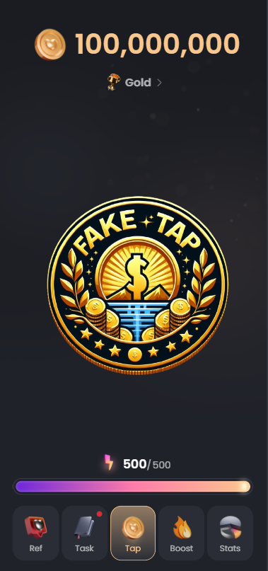
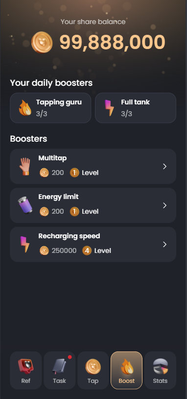
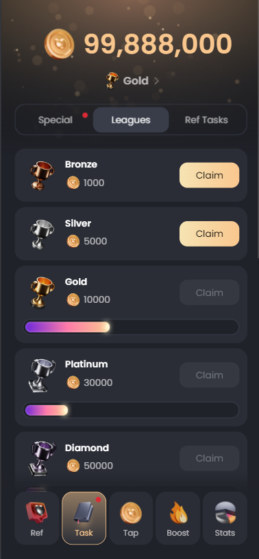

# NotCoin Telegram Bot Clone Source Code [FakeTap](https://t.me/FakeTapBot)

# [FakeTap Bot](https://t.me/FakeTapBot)

[FakeTap](https://t.me/FakeTapBot) Bot is a powerful and interactive AirDrop cryptocurrency bot that allows users to collect points by playing a game and clicking on a coin. Additionally, users can earn more points through referrals and completing daily activities within the bot. This bot is built using HTML, CSS, JavaScript, and PHP and includes a comprehensive admin panel for managing users, activities, and other functionalities.

## Features

<b>⚠️ This project is not yet complete</b>
- **Interactive Game**: Users can collect points by clicking on a coin in a fun and engaging game.
- **Referral System**: Users can earn additional points by inviting others to join and play the game.
- **Daily Activities**: Users can complete daily activities to earn more points.
- **Admin Panel**: A full-featured admin panel to manage users, activities, and view detailed statistics.
  - **User Management**: Add, remove, and manage users.
  - **Task Management**: Create and manage daily activities and missions.
  - **Statistics**: View detailed statistics about user engagement and activity performance.

## Previews

  
  
  
  
  
  

## Technologies Used

- **Frontend**: HTML, CSS, JavaScript
- **Backend**: PHP, mySQL

## Pricing

This script is available for purchase at **$800** only once ! 
📛 Pay First 📛 
📛 Scammers Not Come !!! 📛

## Buying

Contact Me In Telegram : <a href="https://t.me/LampStack">@LampStack</a> 

## Contributing

Contributions are welcome! Please create a pull request with your proposed changes and ensure they adhere to the coding standards of the project.

## License

This project is licensed under the MIT License. See the [LICENSE](LICENSE) file for more details.

## Contact

<a href="https://t.me/LampStack">Telegram</a> 
<a href="mailto:xialop@outlook.com">Email</a>
